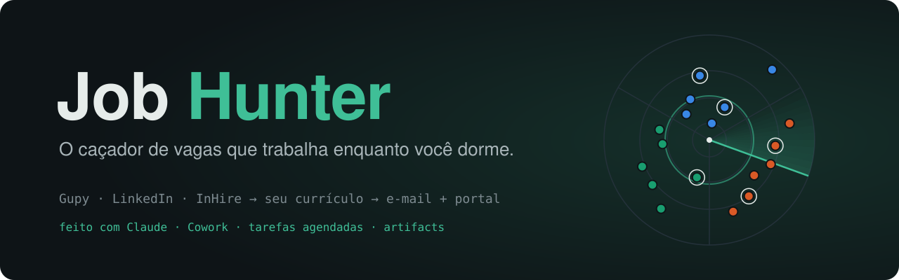
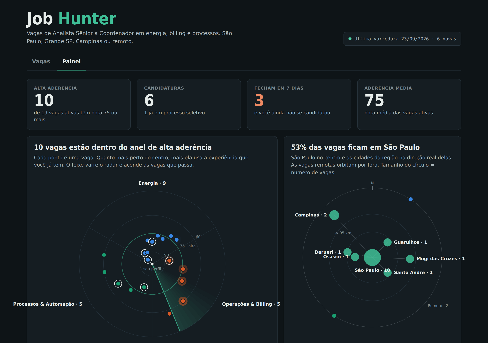
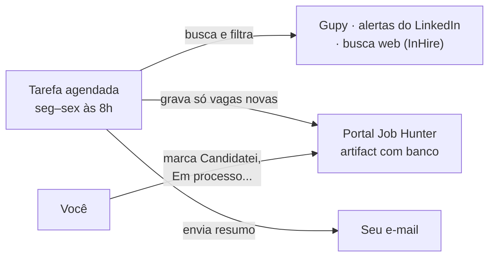
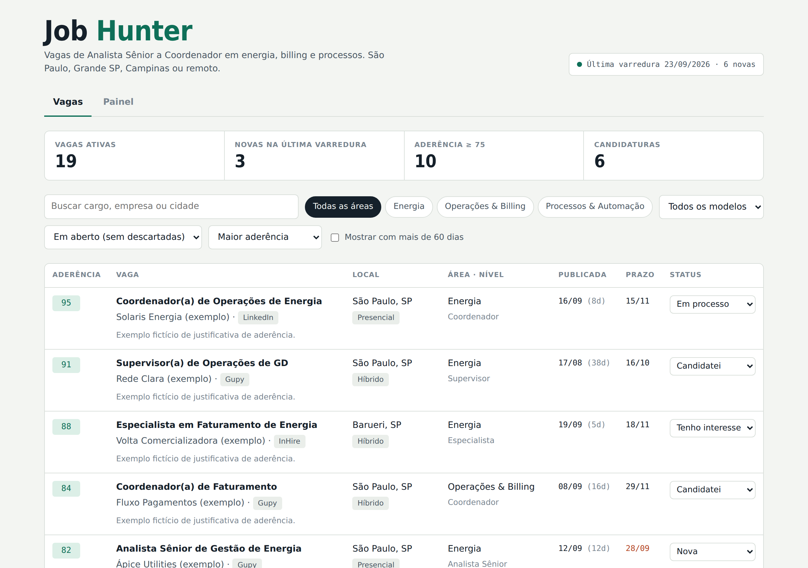
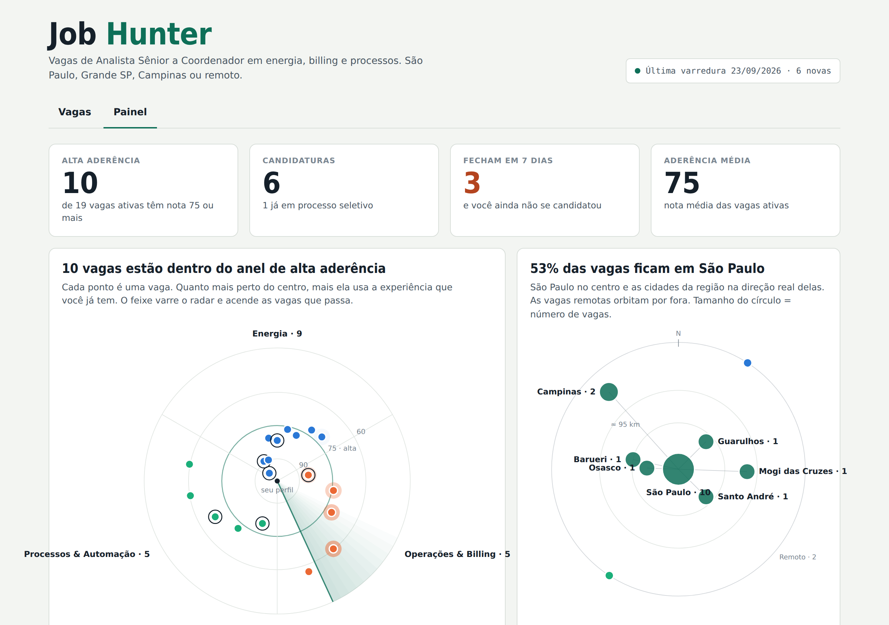

<p align="center">
  
</p>

<p align="center">
  
  
  
  
</p>

**Job Hunter** é um caçador de vagas que roda sozinho dentro do Claude. Toda manhã ele varre portais de emprego, filtra as vagas que combinam com o seu currículo, dá uma nota de aderência de 0 a 100 e manda um resumo por e-mail. Tudo fica num portal com controle de candidaturas e um painel visual animado.

Você não precisa programar nada: a instalação é feita conversando com o Claude.

<p align="center">
  
  <br><sub>Painel com dados de exemplo (empresas fictícias).</sub>
</p>

## Como funciona



- **Filtro pelo seu perfil.** Nível do cargo, cidades aceitas, remoto, áreas de interesse e idade máxima da vaga (padrão: 60 dias).
- **Nota de aderência.** Cada vaga ganha uma nota e uma frase explicando por que combina com a sua experiência.
- **Sem repetição.** A tarefa lê o portal antes de cada varredura: vaga já vista não volta, e o status que você marcou nunca é apagado.
- **E-mail diário.** Tabela ordenada por aderência, com as prioridades do dia no topo. Chega mesmo quando não há vaga nova, para você saber que a varredura rodou.

## Instalação

**Pré-requisitos**

| Item | Para quê |
| --- | --- |
| Plano pago do Claude com Cowork e tarefas agendadas | Rodar a varredura automática |
| Conector do Gmail ativo no Claude | Enviar o resumo e ler os alertas do LinkedIn |
| Currículo em PDF | Base do filtro e da nota |
| Alertas de vaga do LinkedIn chegando no Gmail | Trazer as vagas do LinkedIn |

**Passo a passo (cerca de 15 minutos)**

1. **Prepare o currículo e os alertas do LinkedIn** → [`docs/curriculo-e-linkedin.md`](docs/curriculo-e-linkedin.md)
2. **Baixe o modelo do portal** → [`portal/job-hunter-template.html`](portal/job-hunter-template.html) (botão *Download raw file*)
3. Escolha um caminho:

| Caminho | Para quem | Prompt |
| --- | --- | --- |
| **Instalação rápida** | Quer que o Claude faça tudo numa conversa | [`prompts/00-instalacao-rapida.md`](prompts/00-instalacao-rapida.md) |
| **Passo a passo** | Quer preencher cada variável | [`prompts/01-criar-portal.md`](prompts/01-criar-portal.md) → [`prompts/02-tarefa-agendada.md`](prompts/02-tarefa-agendada.md) |

Todas as variáveis `{{...}}` estão explicadas, com exemplos, em [`docs/variaveis.md`](docs/variaveis.md).

## O portal

<table>
  <tr>
    <td width="50%"></td>
    <td width="50%"></td>
  </tr>
  <tr>
    <td align="center"><sub>Aba <b>Vagas</b>: filtros, nota e status de cada candidatura</sub></td>
    <td align="center"><sub>Aba <b>Painel</b>: sonar, constelação, esteira, prazos e colmeia</sub></td>
  </tr>
</table>

O painel tem cinco visualizações que você lê batendo o olho, sem barras nem pizzas. Detalhes em [`docs/painel.md`](docs/painel.md).

## Estrutura do repositório

```text
job-hunter/
├── portal/
│   └── job-hunter-template.html   # o portal (edite só o bloco CONFIG)
├── prompts/
│   ├── 00-instalacao-rapida.md    # instala tudo numa conversa
│   ├── 01-criar-portal.md         # publica o portal como artifact
│   └── 02-tarefa-agendada.md      # o motor: varredura, e-mail e gravação
├── docs/
│   ├── curriculo-e-linkedin.md    # PDF do currículo e alertas do LinkedIn
│   ├── variaveis.md               # todas as variáveis com exemplos
│   ├── painel.md                  # como ler cada visualização
│   └── faq.md                     # limitações e dúvidas
└── assets/                        # banner e capturas de tela
```

## Limitações

- O LinkedIn bloqueia leitura automática: entram só as vagas dos seus **alertas por e-mail**.
- InHire e outros portais entram por busca na web, com cobertura menor que a da Gupy.
- Cada varredura consome uso do seu plano. Se apertar, rode menos dias ou use menos termos.
- A nota de aderência é uma estimativa. Leia sempre o anúncio antes de se candidatar.

Mais respostas em [`docs/faq.md`](docs/faq.md).

## Privacidade

O portal, a tarefa e os e-mails ficam só na sua conta do Claude. Este repositório não guarda currículo, vaga ou dado pessoal de ninguém.

## Autor

Criado por **[Jakson Oliveira](https://www.linkedin.com/in/jaksonmoliveira/)**, coordenador de operações no setor elétrico, que montou o Job Hunter para a própria busca de emprego e decidiu abrir o projeto.

Contribuições são bem-vindas: abra uma *issue* com sugestões de novas fontes de vagas, visualizações ou adaptações para outras áreas.

<sub>Licença [MIT](LICENSE). Não é um produto oficial da Anthropic, da Gupy, do LinkedIn ou da InHire.</sub>
